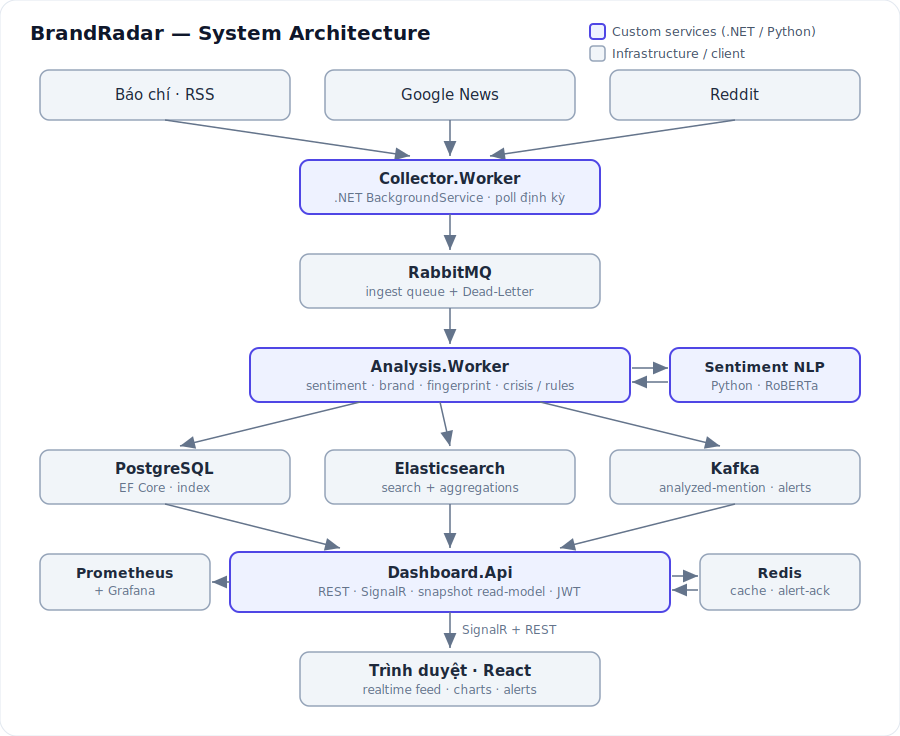

# BrandRadar — Social Listening & Crisis Monitoring

**Languages:** [English](#english) · [Tiếng Việt](#tiếng-việt)

A **social listening & media crisis monitoring** platform built with **.NET 9 microservices** in an **event-driven** architecture. It collects brand mentions from real sources, analyzes **sentiment with NLP**, indexes to **Elasticsearch** for search/analytics, streams **realtime** via Kafka + SignalR, computes a **Brand Health Index**, and fires **configurable crisis alerts**.

<p align="center">
  
</p>

---

# English

## 1. Architecture

Two message backbones with distinct roles — the core design decision:

- **RabbitMQ** — *ingest* work queue: distributes per-article processing with ack/nack + dead-letter so **no data is lost**.
- **Kafka** — realtime *event stream*: fans results out to independent consumers (realtime dashboard, future consumers) without coupling.

```
Real sources: VN news RSS · Google News (per brand) · Reddit
      │  Collector.Worker  (BackgroundService, periodic poll)
      ▼
RabbitMQ  mentions.exchange → mentions.ingest   (→ DLQ on error)
      │  Analysis.Worker  (consume, parallel prefetch, dedup, ack/nack)
      ▼
  Sentiment NLP + Topic + Brand match + Fingerprint + Language
      │
      ├─► PostgreSQL      (EF Core — source of truth + indexes)
      ├─► Elasticsearch   ("mentions" index — full-text + aggregations)
      └─► Kafka           (analyzed-mention / alerts)
                 │
                 ▼
        Dashboard.Api  ──(LiveConsumer)── SignalR ──► Browser (realtime)
        Dashboard.Api  ── REST ◄── Elasticsearch · PostgreSQL(Dapper) · Redis · snapshot
```

## 2. Services & tech

| Component | Role |
|---|---|
| `Collector.Worker` | Pulls RSS/Google News/Reddit (RSS + Atom) → publishes `RawMention` to RabbitMQ. Brand feeds are built **dynamically** from DB keywords. Stable dedup by `source + title`. |
| `Analysis.Worker` | Consumes RabbitMQ → **NLP sentiment** + topic + brand match + fingerprint → writes PostgreSQL + Elasticsearch + Kafka. Hosts **CrisisDetector** (sliding window + spike) and **RuleEngine** (configurable rules). |
| `sentiment-nlp` | **Python (FastAPI + multilingual transformer)** microservice (`cardiffnlp/twitter-xlm-roberta-base-sentiment`). |
| `Dashboard.Api` | REST over **Elasticsearch** (search/aggregation) + **raw SQL/Dapper** (reports) + **Redis** cache + **SignalR** realtime + **JWT** auth + **Prometheus** metrics. |
| `frontend` | **React + Vite + Chart.js** behind nginx (reverse-proxies `/api` & `/hubs`). 10 tabs, charts, realtime, dark/light. |
| Infra | PostgreSQL 16 · RabbitMQ · Kafka (KRaft) · Elasticsearch 8 · Redis · Kibana · Prometheus · Grafana · (optional Ollama) |

**.NET stack:** EF Core 9 (writes) + Dapper (raw-SQL reads) · Elastic.Clients.Elasticsearch · Confluent.Kafka · RabbitMQ.Client · StackExchange.Redis · SignalR · Serilog · JWT Bearer · Polly · prometheus-net.

## 3. Design patterns

- **Strategy** — `ISentimentAnalyzer` (Lexicon / NLP / LLM) and `INotificationChannel` (in-app / Slack / webhook).
- **Decorator / Fallback** — NLP failure/timeout falls back to the lexicon; the pipeline never stalls.
- **CQRS-lite** — write path (EF Core) separate from read path (Dapper raw SQL + Elasticsearch).
- **Read-model / Cache-warming** — `SnapshotRefresher` precomputes the dashboard every 5s.
- **Publisher/Subscriber + Message Bus**, **Rules Engine** (policy in DB vs mechanism in code), **Options**, **Background worker**, **Dead Letter Queue**.

## 4. Highlights

- **Realtime** feed + alerts (Kafka → SignalR), toast + Web Notification + sound; live tab only shows articles published within 6h.
- **Brand Health & Competitive Intelligence** (`GET /api/health`) — **Brand Health Index (0–100)**, **Share of Voice**, momentum, and auto-generated insight via a single native ES aggregation (15s cache).
- **Alert Rules Engine** (`/api/rules`) — user-configurable rules (negative count / volume / negative-share; window; cooldown; channel) evaluated in realtime, multi-channel delivery.
- **Crisis management** — sliding-window + volume-spike detection → alerts (ES/PG), ack (Redis), webhook (Slack), extractive **+ LLM** summary (optional Ollama).
- **Analytics** — sentiment donut, hourly volume, topic cloud, 24h trend, "heating up" brands, **story clustering**, **2-brand comparison**.
- **Mentions** — search + filters, **sort by published or collected time**, paging + total, highlight, detail modal, **CSV export**.
- **Ops** — Redis cache, rate limiting, correlation-id, ProblemDetails, response compression, health `live`/`ready`, Swagger w/ Authorize, unit tests + GitHub Actions CI.
- **Observability** — `/metrics` → Prometheus → Grafana dashboard (RPS, p50/p95/p99, 5xx, top endpoints, GC heap).

## 5. Run

```bash
cd SocialListening
docker compose up -d --build          # first run ~1–2 min (ES + NLP model download)
```

| UI | URL |
|---|---|
| Frontend | http://localhost:3000 |
| Dashboard API (Swagger) | http://localhost:8090/swagger |
| Grafana | http://localhost:3001 |
| Prometheus | http://localhost:9090 |
| Kibana | http://localhost:5602 |

Login for write ops: **admin / admin123** (change via `.env`).

**When to `down -v`:** only when the **DB schema changes** (new table/column). For normal code changes use `docker compose up -d --build <service>` to keep data.

Optional LLM crisis summary:
```bash
docker compose --profile llm up -d ollama
docker compose exec ollama ollama pull llama3.2:1b
```

Linux server deployment: see **[`DEPLOY.md`](./DEPLOY.md)**.

## 6. Main API

| Group | Endpoints |
|---|---|
| Mentions | `GET /api/mentions` (filter · sort · paging) · `/count` · `/export` (CSV) |
| Stats | `GET /api/stats/overview\|top\|timeseries\|trend\|dashboard` |
| Brand Health | `GET /api/health` |
| Reports (SQL) | `GET /api/report/brands\|daily\|trending` |
| Stories | `GET /api/stories` |
| Alerts | `GET /api/alerts` · `/summary` · `POST /api/alerts/{id}/ack` 🔒 |
| Alert rules | `GET /api/rules` · `POST` 🔒 · `PUT /{id}` 🔒 · `POST /{id}/toggle` 🔒 · `DELETE /{id}` 🔒 |
| Brands | `GET/POST/DELETE /api/brands` 🔒 · keywords 🔒 |
| Auth | `POST /api/auth/login` → JWT |
| Ops | `/health/live` · `/health/ready` · `/metrics` · SignalR `/hubs/live` |

(🔒 = requires JWT)

## 7. Kubernetes

Full manifests in **`k8s/`** (namespace, ConfigMap/Secret, infra, apps, **HPA autoscaling**, ingress): `kubectl apply -k k8s/`.

---

# Tiếng Việt

## 1. Kiến trúc

Hai xương sống message **tách vai trò** — quyết định thiết kế cốt lõi:

- **RabbitMQ** — hàng đợi *ingest*: phân phối việc xử lý từng bài, có ack/nack + dead-letter để **không mất dữ liệu**.
- **Kafka** — *event stream* realtime: phát tán kết quả cho nhiều consumer độc lập (dashboard realtime, mở rộng sau) mà không ràng buộc nhau.

```
Nguồn thật: RSS báo VN · Google News (theo brand) · Reddit
      │  Collector.Worker  (BackgroundService, poll định kỳ)
      ▼
RabbitMQ  mentions.exchange → mentions.ingest   (→ DLQ nếu lỗi)
      │  Analysis.Worker  (consume, prefetch song song, dedup, ack/nack)
      ▼
  Sentiment NLP + Topic + Brand match + Fingerprint + Language
      │
      ├─► PostgreSQL      (EF Core — nguồn sự thật + index)
      ├─► Elasticsearch   (index "mentions" — full-text + aggregations)
      └─► Kafka           (analyzed-mention / alerts)
                 │
                 ▼
        Dashboard.Api  ──(LiveConsumer)── SignalR ──► Trình duyệt (realtime)
        Dashboard.Api  ── REST ◄── Elasticsearch · PostgreSQL(Dapper) · Redis · snapshot
```

## 2. Các service & công nghệ

| Thành phần | Vai trò |
|---|---|
| `Collector.Worker` | Kéo RSS/Google News/Reddit (RSS + Atom) → publish `RawMention` vào RabbitMQ. Feed brand sinh **động** từ keyword trong DB. Dedup ổn định theo `source + title`. |
| `Analysis.Worker` | Consume → **NLP sentiment** + topic + brand match + fingerprint → ghi PostgreSQL + Elasticsearch + Kafka. Chứa **CrisisDetector** (cửa sổ trượt + spike) và **RuleEngine** (luật cấu hình được). |
| `sentiment-nlp` | Microservice **Python (FastAPI + transformer đa ngữ)**. |
| `Dashboard.Api` | REST đọc **Elasticsearch** + **SQL thuần/Dapper** (report) + **Redis** cache + **SignalR** realtime + **JWT** + **Prometheus**. |
| `frontend` | **React + Vite + Chart.js** sau nginx (proxy `/api` & `/hubs`). 10 tab, biểu đồ, realtime, sáng/tối. |
| Hạ tầng | PostgreSQL · RabbitMQ · Kafka (KRaft) · Elasticsearch · Redis · Kibana · Prometheus · Grafana · (Ollama tùy chọn) |

## 3. Design pattern

- **Strategy** — `ISentimentAnalyzer` (Lexicon/NLP/LLM), `INotificationChannel` (in-app/Slack/webhook).
- **Decorator/Fallback** — NLP lỗi tự rơi về lexicon, pipeline không đứng.
- **CQRS-lite** — đường ghi (EF Core) tách khỏi đường đọc (Dapper + Elasticsearch).
- **Read-model / Cache-warming** — `SnapshotRefresher` tính sẵn dashboard mỗi 5s.
- **Pub/Sub + Message Bus**, **Rules Engine**, **Options**, **Background worker**, **Dead Letter Queue**.

## 4. Tính năng nổi bật

- **Realtime** feed + cảnh báo (Kafka → SignalR), toast + Web Notification + âm báo; tab Trực tiếp chỉ hiện bài mới trong 6h.
- **Brand Health & Competitive Intelligence** (`GET /api/health`) — **Brand Health Index (0–100)**, **Share of Voice**, đà thảo luận, insight tự sinh; một native ES aggregation, cache 15s.
- **Alert Rules Engine** (`/api/rules`) — luật cảnh báo **cấu hình được** (số tiêu cực / lượng nhắc / % tiêu cực; cửa sổ; cooldown; kênh) đánh giá realtime, gửi đa kênh.
- **Crisis management** — cửa sổ trượt + spike → cảnh báo (ES/PG), ack (Redis), webhook (Slack), tóm tắt trích xuất **+ LLM** (Ollama tùy chọn).
- **Phân tích** — donut sắc thái, khối lượng theo giờ, đám mây chủ đề, xu hướng 24h, brand "nóng lên", **story clustering**, **so sánh 2 thương hiệu**.
- **Mentions** — tìm kiếm + lọc, **sắp xếp theo thời gian đăng/thu thập**, phân trang + tổng, highlight, modal chi tiết, **xuất CSV**.
- **Vận hành** — Redis cache, rate limit, correlation-id, ProblemDetails, health, Swagger, unit test + CI.
- **Observability** — `/metrics` → Prometheus → Grafana (RPS, p50/p95/p99, 5xx, top endpoint, GC heap).

## 5. Chạy

```bash
cd SocialListening
docker compose up -d --build          # lần đầu ~1–2 phút
```

| Giao diện | URL |
|---|---|
| Frontend | http://localhost:3000 |
| Dashboard API (Swagger) | http://localhost:8090/swagger |
| Grafana | http://localhost:3001 |
| Prometheus | http://localhost:9090 |
| Kibana | http://localhost:5602 |

Đăng nhập thao tác ghi: **admin / admin123** (đổi qua `.env`).

**Khi nào cần `down -v`:** chỉ khi **đổi schema DB**. Sửa code thường → `docker compose up -d --build <service>` để giữ dữ liệu.

Triển khai Linux server: xem **[`DEPLOY.md`](./DEPLOY.md)**.

## 6. API chính

Xem bảng endpoint ở phần English (mục 6) — nội dung giống nhau. (🔒 = cần JWT)

## 7. Kubernetes

Manifest đầy đủ ở **`k8s/`**: `kubectl apply -k k8s/`. Chi tiết ở `k8s/README.md`.

---

## Tài liệu khác / Further docs

- `TONG_QUAN_HE_THONG.md` — chi tiết kiến trúc, luồng, pattern (bản dài, tiếng Việt).
- `DEMO_VA_PHONG_VAN.md` — kịch bản demo + hỏi đáp phỏng vấn.
- `DEPLOY.md` — hướng dẫn triển khai Linux server.
- `PLAN.md` · `UI_PLAN.md` · `k8s/README.md`.

## Ghi chú / Notes

- Host ports remapped (5433/5673/9201/5602/8090/3000/9090/3001) to avoid conflicts.
- Facebook/TikTok require paid/approved APIs; the collector is **pluggable** — add a source by writing one adapter.
- Schema is created via `EnsureCreated` (demo-friendly); production should use EF **migrations**.
